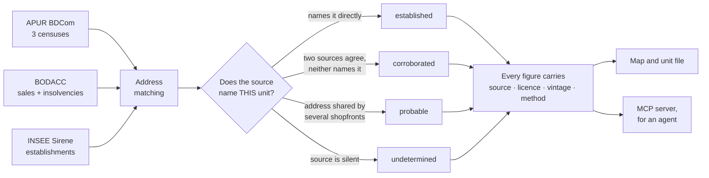

<div align="center">

# Compass

**Context is the product.**

*Every commercial-property tool describes the unit — surface, rent, photos — and leaves you to guess the rest. Compass reads the street instead, from public records only, and tells you how sure it is of each answer.*

[](https://paris-compass.lovable.app)
[](#scope)
[](#where-every-number-comes-from)
[](#how-a-number-earns-its-place)
[](LICENSE)
[](#stack)

**[Open the map →](https://paris-compass.lovable.app)** · no account needed

</div>

---

> Compass sells neither coverage nor granularity — it sells **interpretation**. The value is not the number of sources plugged in; it is the distance between a raw figure and a sentence you can decide on.

A 3/6/9 lease is a nine-year bet, made today on one visit, a hunch about passing trade, and whatever the landlord says.

---

## The question

You are standing in front of an empty shopfront. The agent says the street is lively.

Compass answers on six axes at once.

| | |
| --- | --- |
| **What was here** | florist 2017 → florist 2020 → gone by 2023 |
| **How the street behaves** | half the units turned over in three years — and the empty ones refilled |
| **What it costs** | median *fonds* 160 000 €, 220 000 € for a café |
| **What is moving now** | an insolvency filed here is public months before any listing |
| **What is around it** | schools, healthcare, food, parks and transit counted within **800 m**, aggregated into walkability |
| **What the environment is worth** | air quality **measured** (Copernicus), natural and technological risks within **1 km**, noise **modelled** from major roads at 500 m |

Each of those arrives with its source, its date and its confidence level.

Note the wording, because the product keeps it too: air quality is *measured*, noise is *modelled*. Noise and footfall are proxies, labelled as such on screen and here.

---

## Three that deserve more than a line

**Has a kitchen ever been here?**
If a restaurant occupied the unit, the extraction, grease trap and power are probably already in. If not, creating them runs into tens of thousands and needs the building's agreement. The most expensive question this data answers — before you travel.

**Is this a graveyard or a good street?**
Rue d'Argout turned over half its shops in three years — but it also filled its three empty units. Churning upward, not dying. And turnover only means something against its own trade: of the cafés trading in 2017, **77% were still trading six years later around Les Halles, 56% in the quartier du Mail**. Same city, same trade, a different bet.

**What did people actually pay?**
25 496 goodwill sales published with their price since 2015. For the 5 934 tied to a single shopfront, the median Paris *fonds* changes hands at **160 000 €** — and the trade decides almost everything.

| Food shop | Café / restaurant | Clothing | Personal services |
| --- | --- | --- | --- |
| 250 000 € | 220 000 € | 86 000 € | 50 000 € |

---

## How a number earns its place

Every figure arrives with its source, its licence, its date — **and how sure it is**.



> **Four levels, never a percentage.** A confidence score out of 100 would be exactly the kind of unverifiable number this product refuses. The level is *computed* from columns that already exist, and every row carries the reason that produced it.

Today's composition across the corpus — this is the quality metric, and improving means moving these four numbers leftward:

| established | corroborated | probable | undetermined |
| --- | --- | --- | --- |
| **51.4%** | 5.9% | 36.7% | 6.0% |

That 36.7% is structural, not laziness: BODACC names an *address*, BDCom names a *unit*, and 69% of units share their street number. No public data will say which of eight shopfronts was sold.

A gate runs the whole corpus against **18 invariants, 24 frozen baselines and 8 hand-verified chronologies** before anything ships. Seventeen of those invariants check what the functions return; the eighteenth checks what they *are* — a function exposing an `observed` column must be `SECURITY DEFINER`, because row-level security silently turns a withheld row into "never surveyed".

---

## Two founding constraints

> **If a number cannot be re-derived from a cited public source, it is not shown.**

No landlord declarations, no scraped listings, no proprietary estimate, no score invented to fill a gap. Missing data is displayed as missing — `n/a`, never `0`.

> **If two units on the same street get the same verdict, Compass has said nothing.**

The useful granularity is the street segment, sometimes the side of the pavement. An indicator that does not vary at that scale describes general context; it does not settle a decision.

---

## Who it is for

**The entrepreneur** — the shopkeeper, restaurateur, craftsperson or franchisee who decides *where* to open. Once or twice in a working life, committing to nine years.

**An agent** — an LLM asking the same question through an MCP server. Same scoring core, same traceability requirement, different output: JSON and a chain of thought instead of a map.

**Not brokers.** A broker qualifies dozens of locations a month and needs portfolios, bulk comparison, national coverage. Every one of those makes the product heavier for someone studying a single address in depth. Serving both serves neither — a broker who wants Compass gets what the agent gets: the API.

---

## What it refuses

Every refusal buys something back. The trade is the point.

| It refuses | What that buys |
| --- | --- |
| **A listings portal** | Position *upstream* of the listing. Compass shows what is coming free — ceased trading, goodwill sold, court-wound-up, censused empty — not what everyone already sees |
| **A rent estimate** | Honesty about the one number everybody wants. No open dataset of actual commercial rents exists in France |
| **A revenue forecast** | Credibility. Inventing it would poison every other number on the page |
| **A single score out of 100** | A bakery wants footfall, a yoga studio wants quiet, a wine merchant wants median income. One score averages away what pulls against itself |
| **National coverage** | Depth. The sources that carry the value are local |
| **An account to explore** | Nothing to get past before finding out whether the tool is any use |

<details>
<summary><b>What it cannot answer, and why</b> — the gaps shape the product more than the features do</summary>

<br/>

**What rent will I pay?**
No open observatory of commercial rents exists in France. Local rent observatories cover private *housing*; INSEE's ILC is a revision index, not a level. Street-level commercial values are sold by private vendors — which is the proof they are not open. Goodwill sale prices carry an indirect signal and nothing more.

**How many people walk past this door?**
Paris has no permanent pedestrian sensor: the city's multimodal counters cover bikes, scooters, motorcycles, cars, lorries and buses — not pedestrians. Telco and trajectory data are proprietary, costly and heavy under GDPR. Compass measures *presence and rhythm* instead.

**What do people here spend, and on what?**
Card transaction data: proprietary. No workaround.

**Which units are on the market today?**
Commercial listings live on private portals whose terms forbid reuse. Which is why Compass works upstream of them instead.

</details>

---

## Status

Honest labels, in the sense that *built* means the code runs and the gate passes — not that it is deployed.

| Component | State |
| --- | --- |
| Map, neighbourhood scoring, environment panel | **Live** |
| Provenance surfaced on every figure | **Built** — merged, ships on the next deploy |
| BDCom ×3 · BODACC · Sirene · geography | **Built** — 85 418 units, 228 275 census records, gate green. 27 migration files in the repository, counted 24 August 2026 |
| Deployed to the hosted database | **Live since 15 August 2026** — the browser reads it anonymously with the publishable key, verified 24 August |
| Premise history in the browser — BDCom ×3 and BODACC on one timeline | **Built** — 24 August 2026, demonstrated against the hosted database in a dev browser; ships on the next deploy. [`docs/tickets/w0-fiche.md`](docs/tickets/w0-fiche.md) |
| Exportable one-address file | Design |
| MCP server for agents | **Built** — runs locally (`mcp-server/`), not published to npm or listed on an MCP registry yet |
| Agent self-assessment of its own confidence | Research |

---

## Where every number comes from

<details>
<summary><b>Connected today</b></summary>

<br/>

| Source | Producer | Use | Licence |
| --- | --- | --- | --- |
| OpenStreetMap (Overpass) | OSM contributors | Vacant and occupied units, retail, schools, healthcare, parks, transit, roads | ODbL |
| Base Adresse Nationale | Etalab / IGN | Geocoding | Licence Ouverte 2.0 |
| Rent control dataset | Ville de Paris / OLAP | **Housing only** — a catchment-area signal, never presented as a commercial rent, never multiplied by a floor area, never a filter | ODbL |
| CAMS Europe (Open-Meteo) | Copernicus | AQI, PM2.5, NO₂ | CC BY 4.0 |
| Géorisques | BRGM / MTE | Natural and technological risks within 1 km | Licence Ouverte 2.0 |

Scores computed client-side: walkability, transport access, density per category, noise and footfall — the last two **explicitly labelled estimates**, for lack of a reliable open source.

</details>

<details>
<summary><b>Ingested, awaiting deployment</b></summary>

<br/>

| Source | Producer | Contribution |
| --- | --- | --- |
| **BDCom** 2017 / 2020 / 2023 | APUR | Door-to-door census of every ground-floor unit with a shop window, 224-activity nomenclature, floor-area bands. The unit identifier is stable across vintages, so three censuses give **turnover measured against its own street**, with previous lives as the evidence. Two limits are part of the claim: vacancy is measurable on 2017 and 2020 only — the 2023 layer carries retail alone, so a missing unit is "no longer a shop", not "empty" — and the licence differs by vintage, so BDCom cannot be announced as ODbL across the board |
| **BODACC** | DILA | Goodwill sales *with their price*, and insolvency proceedings — the closest public figure to what an entrepreneur will pay, and a signal that a unit is coming free |
| **Sirene** geolocated | INSEE | Corroboration: places an establishment of the same company at the address, which raises a notice to *corroborated* without ever making it *established* |

</details>

<details>
<summary><b>Planned</b></summary>

<br/>

| Source | Producer | Contribution |
| --- | --- | --- |
| Mobiliscope | CNRS | Population *actually present* hour by hour — distinguishes an office district that triples at noon from a residential one |
| PLU commercial protections | Ville de Paris | On a protected frontage, a ground-floor unit cannot change use. The first thing that can kill a project |
| Transit validations | Île-de-France Mobilités | Counted entries per station, hourly since 2015 — replaces the footfall proxy with a measured number |
| DVF | DGFiP | Sale prices of the walls per m² |
| INSEE IRIS / FiLoSoFi | INSEE | Population, income, socio-professional categories |
| GTFS IDFM | Île-de-France Mobilités | Real travel times and frequencies |
| Bruitparif | Bruitparif | Modelled and measured noise, replacing the road proxy |
| Sitadel | SDES | Planning permissions — future residents and future competitors, two years ahead |

</details>

### Scope

Paris intra-muros first, Île-de-France next. Depth over breadth: the sources that carry the value are local.

---

## Stack

React 18 · TypeScript · Vite 5 · Tailwind + shadcn/ui · Leaflet (direct, no wrapper) · TanStack Query · Supabase + PostGIS

`src/core/` is pure — no fetch, no React, no DOM. That is what lets the same scoring serve a browser, a test runner and an MCP server.

<details>
<summary><b>Run it locally</b></summary>

<br/>

Node.js 18+.

```sh
git clone https://github.com/IvandeMurard/paris-compass.git
cd paris-compass
npm install
npm run dev
```

Served at `http://localhost:8080`.

| Script | Does |
| --- | --- |
| `npm run dev` | Vite dev server with HMR |
| `npm run typecheck` | `tsc --noEmit` |
| `npm run test` | Vitest |
| `npm run eval` | The gate: invariants, baselines, golden cases |
| `npm run build` | Production build |

Open data sources need no key. For your own backend, put `VITE_SUPABASE_URL` and `VITE_SUPABASE_PUBLISHABLE_KEY` in `.env.local`. Only `VITE_`-prefixed variables reach the browser — never put a service-role or paid key there.

</details>

---

## Licence and attribution

**The code is [Apache-2.0](LICENSE). The data is not.**

That distinction matters more than it looks on a product built entirely from open data. The licence covers what is in this repository — the scoring core, the ingestion pipeline, the interface. It grants nothing over the datasets, which keep their own terms:

| | Requires |
| --- | --- |
| **ODbL** — OpenStreetMap, rent control dataset, BDCom 2023 | Attribution *and* share-alike. Any reuse must credit *© OpenStreetMap contributors* |
| **Licence Ouverte 2.0** — Base Adresse Nationale, Géorisques, Sirene | Naming the source and its update date |
| **CC BY 4.0** — CAMS Europe / Copernicus | Attribution |

**BDCom 2017 and 2020 are not redistributable at all.** Their licence differs from the 2023 vintage, which is why the database carries a `publicly_redistributable` flag per vintage and withholds their content from an anonymous caller — content *and* absence alike, so that withholding leaks nothing either.

This repository contains **no data extract**, and must not. It contains the code that fetches, models and cites the data.

Made by **[Ivan de Murard](https://github.com/IvandeMurard)**.

*Interested in the approach, or in the MCP layer? Open an issue.*
